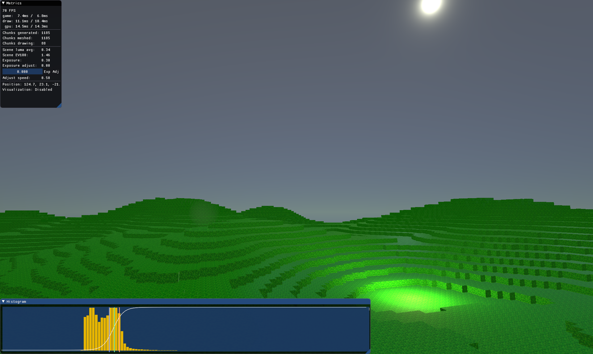

# Phosphor Renderer

Phosphor is a general-purpose deferred RPB renderer, written in pure rust. Currently under heavy development, nowhere near stable yet.

## Features:
* Fully physically-based pipeline
* Deferred pipeline
* Image-based ambient lighting
* Text rendering

## Roadmap:
* Generic material system
* Auto exposure adjustment (partially complete)
* Shadows
* Light influence volumes
* FXAA
* Bloom
* SSAO
* Subsurface scattering
* Parametric lights
* Scene reflection captures
* IES profiles

## Usage:

Don't. Check back in a month or so.

If you're feeling *really* adventurous, check out [Gestalt](https://github.com/NotGyro/Gestalt) for an example of a project using phosphor.
